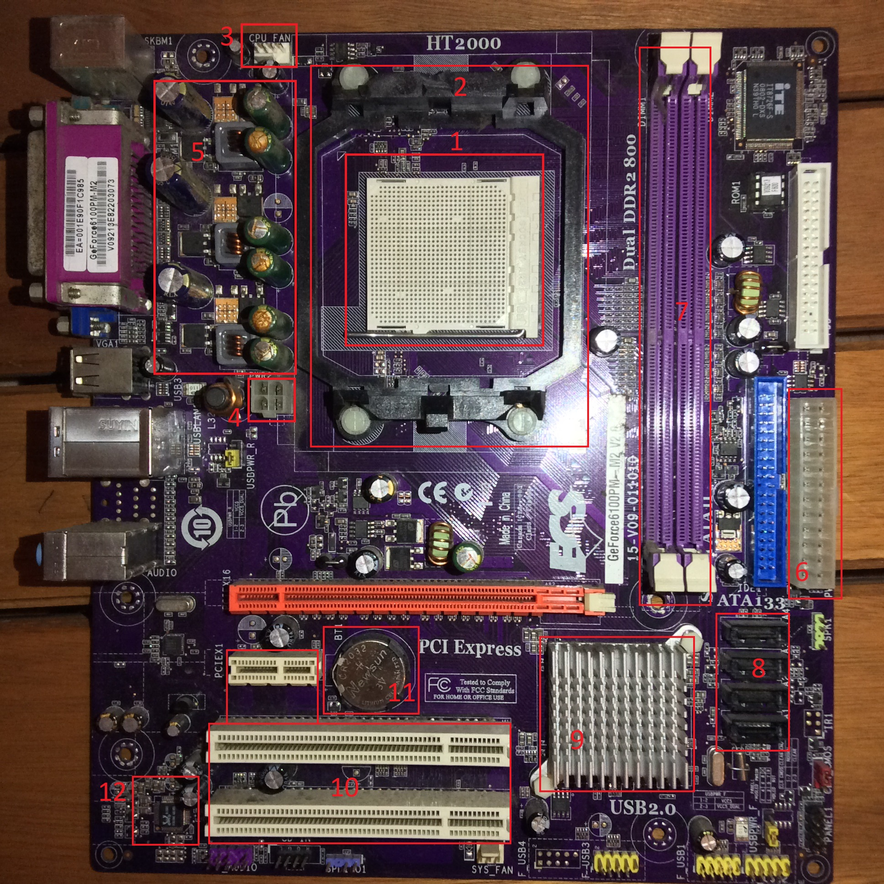

# Detalle de placa madre

_Es un modelo viejito que encontré para practicar HT2000_

### 1- Socket CPU 
Es donde se aloja nuestro procesador. Dependiendo del modelo de placa madre varía el diseño.

### 2- Soporte para disipador 
Es de donde podemos encastrar nuestro disipador, el cual mantendrá la temperatura de nuestro procesador.

### 3- CPU FAN
Nuestro disipador por lo general lleva un juego de ventiladores los cuales requieren un suministro de energía. En las placas madre se tiene contemplado esto
por lo que puede llegar a haber varios conectores para eso.

### 4- EPS
A través de él ingresa la corriente para suministrar al procesador. El pasaje no es directo, sino que previo pasa por el VRM o regulador de voltaje.

### 5- VRM - Regulador de voltaje
Se encarga de regular el voltaje que viene desde el EPS, debido a que nuestro procesador trabaja con menores voltajes del que ingresa. 
Cada par representa una fase y se especializan en dar voltajes precisos en cada momento.

### 6- ATX
Alimenta de energía a la memoria RAM y al resto de la placa madre.

### 7- Slots para RAM
En ellos se alojan nuestras memorias. Siempre viene de a pares.

### 8- SATA
En ellos conectaremos nuestros HDD (Discos duros).

### 9- PCH
Se encarga de recibir todas las señales de los periféricos y gestionar la comunicación de estos con el procesador.
Es un procesador más y por lo general tiene también un disipador ya que genera calor.

### 10- PCI Express 
En ellos podemos conectar nuestras extensiones, como por ejemplo una tarjeta gráfica, de sonido, red, etc.
Tanto el PCIE como los slots de RAM, tienen comunicación directa con el procesador y no pasan por el PCH.

### 11- Pila BIOS
Basic Input Output System. Es el encargado de revisar y arrancar nuestro sistema.
Este tiene una pequeña pila y sirve para mantener la fecha y hora actualizada aunque no haya ingreso de energía.

### 12- Procesador audio
Es otro procesador incluido en la placa encargado para gestionar el sonido. Por lo general está lo más alejado posible de todo el resto.