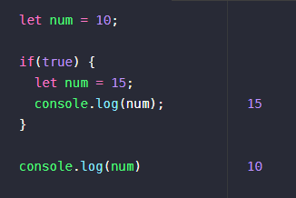
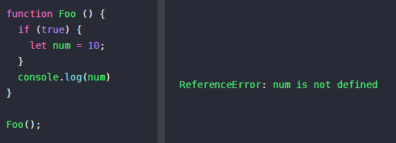
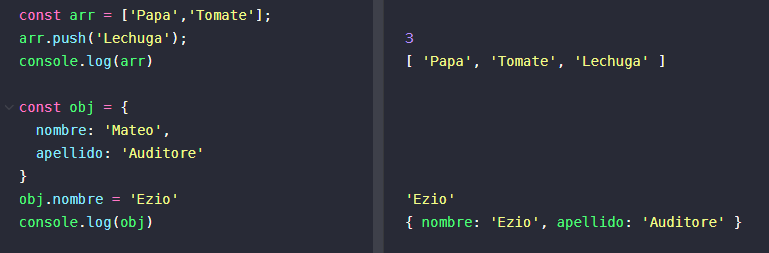
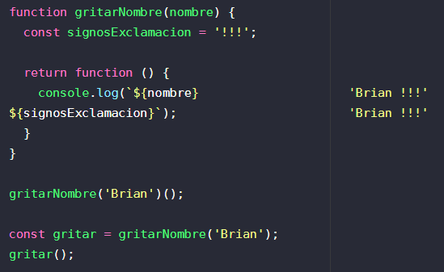
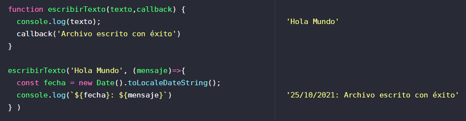

### Let y Const
Ambas son formas de declarar variables en JS que fueron introducidads en ES6 que **limitan el ámbito de la variable** al **bloque** (todo lo que esta entre llaves) en el que fueron declaradas.

Si declaramos la variable **let** en el ámbito global o en el de una función, esta pertenece al ámbito global o al de la función respectivamente.



Fuera del bloque donde se declara con let, la variable no está definida.



**Const** funciona de la misma manera en el aspecto del **Scope**, solamente que este tiene una prohibición sobre la reasignación de valores (ya que es una constante).


Si el valor de una constante es "mutable", como un array o un objeto, es posible cambiar sus elementos internos.



:::info
Con let es posible declararla pero no inicializarla, distinto de const que es obligatorio inicializarla.
:::

### Funciones anónimas

1- Función anonima asignada a una variable.
``` js
    const foo = function() { /*...*/}
```

2- Retornando una función anónima desde una función.
``` js
    function foo() {return function() {/*...*/}}
```

3- Invocando inmediatamente una función anónima (IIFE). 
``` js
    (function(param) {/*...*/} )(param)
```

### Scope
* Indica el ámbito o alcance actual de ejecución.
* En él los valores y expresiones son "visibles".
* Los Scope también se pueden superponer en una jerarquía, de modo que los Scope secundarios que tengan acceso a los ámbitos primarios, pero no al revés.

### Closure
Es una función que **guarda referencias del estado adyacente**. Esto significa que te permite acceder al ámbito de una función exterior desde una función interior. Un closure o clausura se inicializa cada vez que una función es creada.



### Clases

``` js
    class Cliente {

        static dinero = 0;

        constructor (nombre, fecha, direccion) {
            this.nombre = nombre;
            this.fechaNacimiento = fecha;
            this.direccion = direccion;
        }

        agregarDinero(dinero){
            Cliente.dinero += dinero
        }
      
      mostrarDinero() {
        console.log(Cliente.dinero)
      }

    }


    const brian = new Cliente('Brian', '13/04/1990','Avenida siempre viva 123')
```

:::info
**static** es un método común para todas las instancias. Si creamos multiples intancias de Cliente y en todas agregamos dinero, ```static dinero``` valdría en total la suma de todo el dinero agregado por todas las instancias.
:::

### Callback
Es una función que se envía como argumento a otra función, con la intención de que la función receptora ejecute la función que se le está pasando por parámetro.

Un buen ejemplo que me sirvió para entender un poco más su uso fue el siguiente:

Queremos escribir un archivo y registrar en un log la hora en que este se termine. Es muy probable que no sepamos en que momento exacto vaya a terminar.

En estos escenarios, las funciones deben recibir como último parámetro un callback, que (por convención) será ejecutado al finalizar la ejecución de la función.



**Convenciones de callbacks:**
* Siempre es el último parámetro.
* Es una función que recibe dos parámetros.
* La función llama al callback al terminar de ejecutar todas sus operaciones.
* Si la operación fue exitosa, la función llamará al callback pasando null como primer parámetro y si generó algún resultado este se pasará como segundo parámetro.
* Si la operación resultó en un error, la función llamará al callback pasando el error obtenido como primer parámetro.


### Promesas