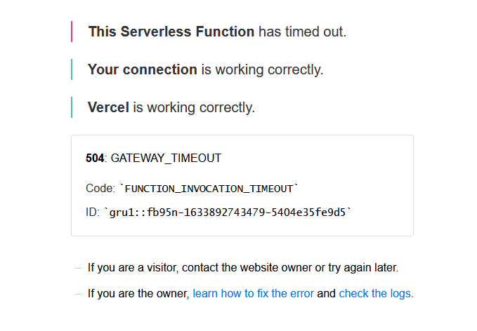
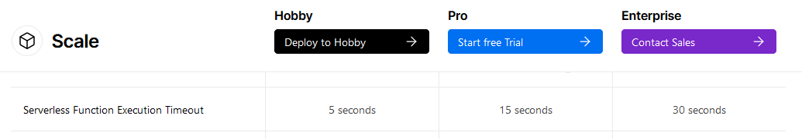
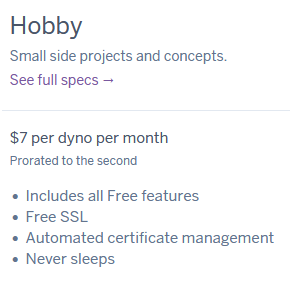

:::note Repositorio Oficial
[ShareLink-Frontend](https://github.com/Alfacoy/share-it)

[ShareLink-Backend](https://github.com/Alfacoy/ShareLink-backend)
:::

:::info Mi ShareLink
[Mi propio ShareLink](https://mysharelink.vercel.app/)
:::

### Detalle
ShareLink es una aplicación que nos permite reunir en un mismo sitio todos los enlaces que queramos compartir. 

Cuenta con un panel de administración, donde podrás agregar y personalizar tu contenido y por otro lado un sitio web para compartir todo lo que quieras con el mundo.

### Inspiración
Está totalmente inspirado en [LinkTree](https://linktr.ee/), por lo que de seguro les parece familiar este proyecto.

Si les interesa este tipo de aplicaciones les recomiendo ingresar al enlace ya que tiene funciones muy buenas como estadísticas, monetización, customización, etc.

### Tecnologías usadas
ShareLink está construido con las siguientes tecnologías:
* Heroku
* Strapi
* Next.js + Vercel

### Lista de errores conocidos

**504 gateway_timeout**

Esto se debe a que, en mi caso, el frontend lo estoy hosteando en Vercel y el backend en Heroku, ambos con cuentas gratuitas.

Cuando nuestro backend no recibe interacción durante 30 minutos este se duerme dejando fuera de servicio la API que tenemos alojada en él.
En caso de que ingrese alguna interacción estando en este modo de descanso, tarda 10 segundos en ponerse activo nuevamente. 

Al usar Vercel en su versión gratuita, el tiempo máximo de espera que tenemos para recibir una respuesta del servidor es de 5 segundos.

Lo ideal sería que nuestro server no durmiera, por lo que tenemos 2 alternativas:
* Pagar una cuenta de hobby por 7usd al mes.

* Enviar peticiones cada 30 minutos a nuestro server para evitar que este duerma. Gracias a [Kaffeine](https://kaffeine.herokuapp.com/#!) esto es posible.
Lo malo de esta opción es que agotará nuestras horas de dyno gratuitas.